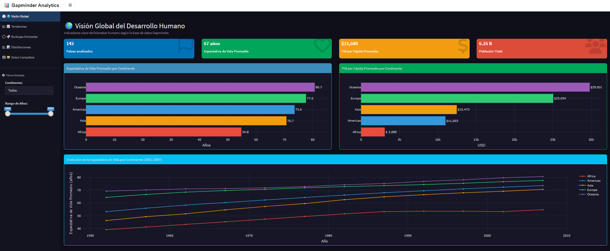
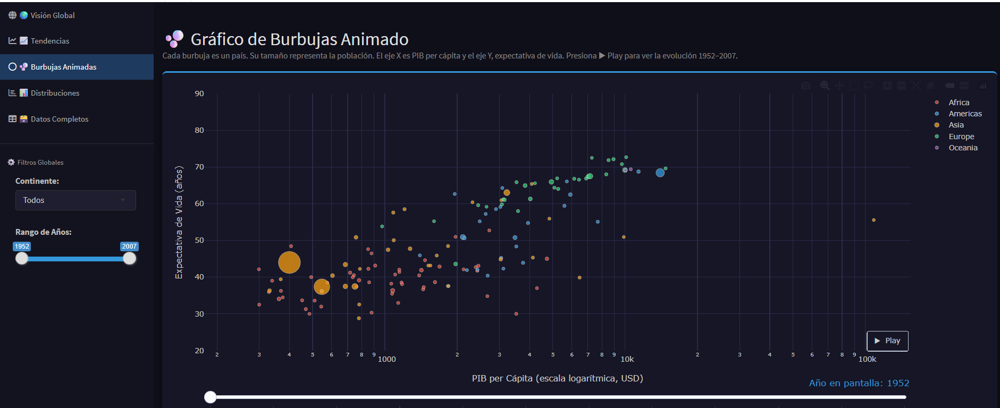
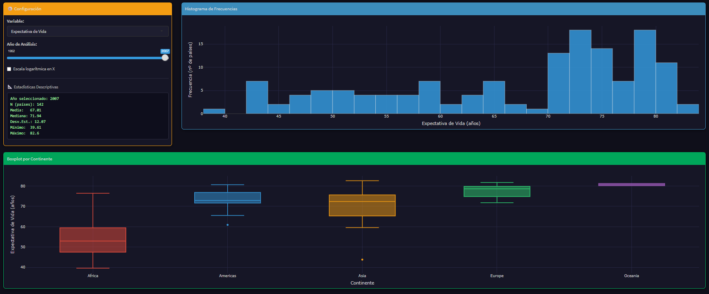

# Visión Global del Desarrollo Humano: Evolución de la Esperanza de Vida (1952–2007)

## Descripción del Proyecto

Este proyecto desarrolla un dashboard interactivo en R Shiny para analizar la evolución histórica del bienestar humano global entre 1952 y 2007 utilizando información de Gapminder.

El sistema permite explorar la relación entre:

- Esperanza de vida
- PIB per cápita
- Población
- Diferencias regionales

mediante visualizaciones dinámicas e interactivas.

---

## Dashboard Publicado

🔗 https://johanaiga.shinyapps.io/PAC_Grupo4/

---

## Presentación RPubs

🔗 https://rpubs.com/JohanaIGA/shiny-gapminder

---

## Repositorio GitHub

🔗 https://github.com/Mil254/PAC

---

# Objetivo

Analizar la evolución del bienestar humano global entre 1952 y 2007 mediante la relación entre el PIB per cápita y la esperanza de vida, considerando además el tamaño poblacional y las diferencias regionales.

---

# Tecnologías Utilizadas

- R
- Shiny
- shinydashboard
- ggplot2
- plotly
- DT
- dplyr
- gapminder
- leaflet
- scales
- maps

---

# Capturas del Dashboard

## Página principal

---

## Gráfico de burbujas animado

---

## Estadísticas descriptivas

---

## Video demostrativo

[Ver demo del dashboard](./Demo_dashboard.mp4)

---
# Funcionalidades

- Filtros interactivos por país y continente
- Visualizaciones dinámicas
- Bubble chart animado
- Histogramas y boxplots
- Tablas descargables
- Comparaciones regionales

---

# Ventajas del Dashboard

- Interactividad dinámica
- Exploración visual intuitiva
- Comparación multidimensional
- Integración estadística
- Transparencia de datos

---

# Limitaciones

- Restricción temporal 1952–2007
- Variables limitadas
- Dependencia de Gapminder
- Requiere interpretación estadística básica

---

# Integrantes

- Efraín Carlos Balbuena Cárdenas
- Hanghell Cornejo Rodríguez
- Johana Guadalupe Milagros Inga Gamarra
- Roger Guerra Quispe

---

# Fuente de Datos

Gapminder Foundation  
https://www.gapminder.org/data/
